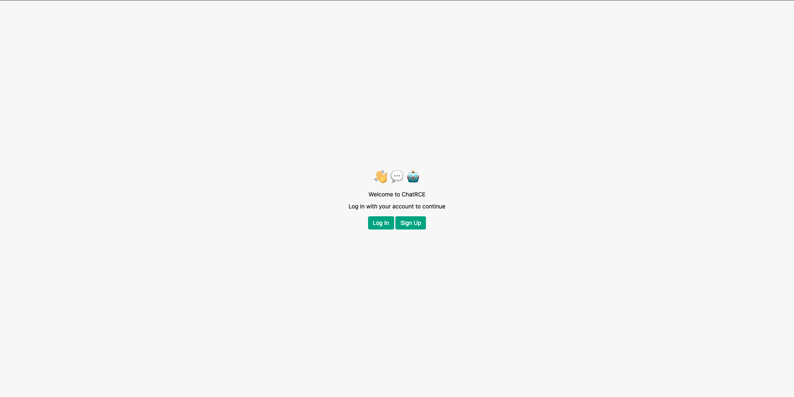
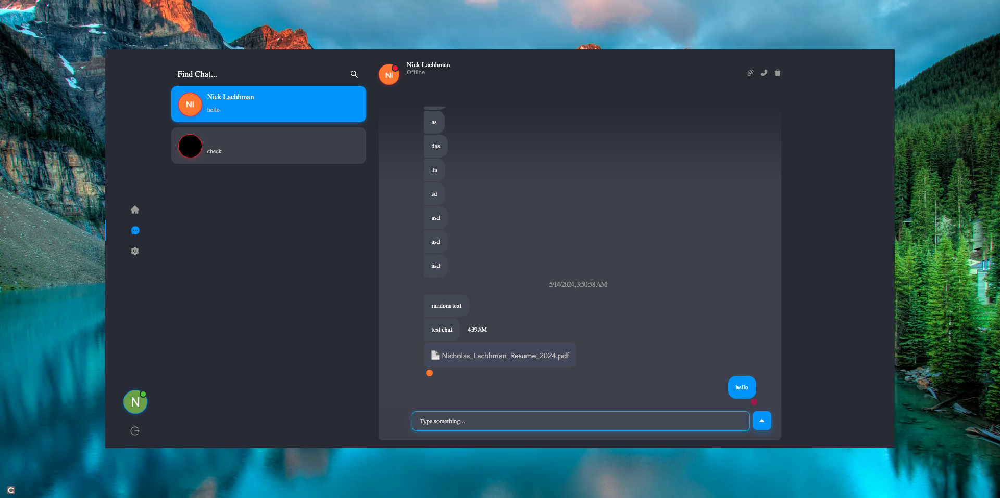

# Check it out:

https://quantum-bot-core.vercel.app/

# ABOUT THIS PROJECT:

This project is a chat application that was built with a Node and Firebase backend with a Next.js frontend and deployed on vercel.

# HOW IT WAS BUILT:

The frontend of the project utilizes the Next.js React framework with ant design tools and icons. It utilizes the react-chat-engine package to handle the main functionality of the chat application. The frontend is hosted on vercel.

The backend of the application consists of firebase functions used to handle user sign up and log in as well as CRUD operations for the user chats and messages. Currently, the application hosts 10 users maximum.

###### Auth page

###### Chats Page

